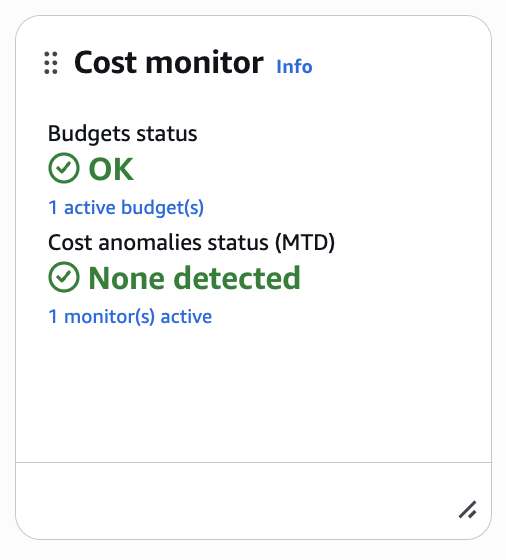

# AWS Internship Cleanup Checklist

## Week 1

- [x] Delete unused IAM users (if created only for practice)
- [x] Delete unused IAM groups
- [x] Delete unused custom IAM policies

---

## Week 2

- [x] Terminate EC2 instances
- [x] Delete Security Groups
- [x] Delete Network ACLs (if custom)
- [x] Delete Route Tables (if custom)
- [x] Delete Internet Gateway
- [x] Delete Public & Private Subnets
- [x] Delete VPC

---

## Week 3

- [x] Delete CloudWatch Alarms
- [x] Delete Launch Template
- [x] Delete Auto Scaling Group
- [x] Delete Target Group
- [x] Delete Application Load Balancer

---

## Week 4

- [x] Empty S3 bucket
- [x] Delete S3 bucket
- [x] Delete IAM Role
- [x] Delete IAM Policy
- [x] Delete Standalone EC2 instance

---

## Final Verification

- [x] No running EC2 instances
- [x] No unattached EBS volumes
- [x] No Elastic IPs
- [x] No Load Balancers
- [x] No Target Groups
- [x] No Launch Templates
- [x] No CloudWatch Alarms
- [x] No S3 buckets created during the internship
- [x] No unnecessary IAM roles or policies
- [x] Billing dashboard shows no unexpected active resources

---

## AWS Resources That Commonly Incur Charges

| Resource | Notes |
|----------|-------|
| EC2 Instances | Running instances incur compute charges. |
| EBS Volumes | Persist until deleted. |
| Application Load Balancers | Charged while active, regardless of traffic. |
| NAT Gateways | Charged hourly and for processed data. |
| Elastic IPs | May incur charges when allocated but unused. |

---

## Lesson 

One of the biggest differences between cloud infrastructure and local development is that cloud resources continue running until they are explicitly stopped or deleted. Performing cleanup after every task is essential to prevent unnecessary costs and maintain a clean AWS environment.

---
