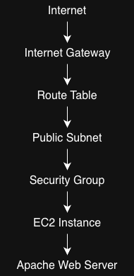
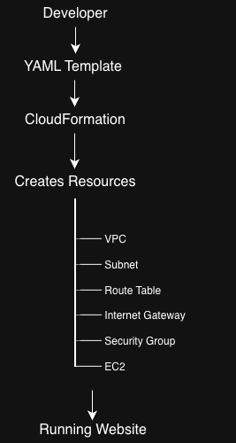

# Week 3 – Task 3

## Infrastructure as Code with AWS CloudFormation

### Objective

Provision AWS infrastructure using Infrastructure as Code (IaC) instead of manually creating resources through the AWS Management Console.

---

## Learning Objectives

- Understand Infrastructure as Code (IaC)
- Learn CloudFormation templates
- Understand Stacks
- Learn how AWS resources reference each other
- Deploy reusable infrastructure

---

## Concepts Learned

- Infrastructure as Code (IaC)
- CloudFormation Templates
- Logical IDs
- Intrinsic Functions (`!Ref`)
- Resource Dependencies
- `DependsOn`
- Route Table Associations
- Security Groups
- EC2 UserData
- Fn::Base64
- Automated instance intialization

---

## Architecture

```
Internet
    │
Internet Gateway
    │
   VPC
    │
Public Subnet
    │
Route Table
    │
Security Group
    │
   EC2
```

---

## Deployment Workflow

CloudFormation Template (YAML)
↓
Validate Template
↓
Create Stack
↓
CloudFormation provisions infrastructure
↓
EC2 executes UserData
↓
Apache installs automatically
↓
Website becomes available

---
## Technologies

- AWS CloudFormation
- Amazon EC2
- Amazon VPC
- Internet Gateway
- Route Tables
- Security Groups
- YAML

---

## Mental Model

CloudFormation Template (YAML)
        │
        ▼
CloudFormation Stack
        │
        ▼
Creates AWS Resources
        │
        ├── VPC
        ├── Internet Gateway
        ├── Public Subnet
        ├── Route Table
        ├── Security Group
        └── EC2 Instance
                    │
                    ▼
      Latest Amazon Linux AMI (SSM)



---
## Design Decisions

### Dynamic AMI Selection
Instead of hardcoding an Amazon Machine Image (AMI) ID, this template retrieves the latest Amazon Linux 2023 AMI directly from AWS Systems Manager Parameter Store.
Benefits:
- No manual AMI updates
- Automatically uses the latest Amazon Linux release
- Works across AWS Regions
- Improves template maintainability

### Parameterized SSH Access
Instead of allowing SSH access from every IP address, the template accepts the administrator's public IPv4 address as a CloudFormation Parameter.
Benefits:
- Improved security
- Reusable template
- Easy to deploy from different locations

---
## Current Progress

- [x] Created CloudFormation project structure
- [x] Created template skeleton
- [x] Created VPC
- [x] Created Internet Gateway
- [x] Attached Internet Gateway to VPC
- [x] Created Public Subnet
- [x] Created Public Route Table
- [x] Added default Internet route
- [x] Associated Public Subnet with Route Table
- [x] Created Web Security Group
- [x] Parameterized SSH access
- [x] Added EC2 Instance
- [x] Configured dynamic AMI selection (AWS Systems Manager Parameter Store)
- [x] UserData
- [x] Outputs
- [x] Validate Template
- [x] Deploy Stack
- [x] Verify Resources
- [x] Capture Screenshots

---

## Week 3 Reflection

This week helped me understand the difference between manually creating AWS infrastructure and defining it as code.
The biggest takeaway was realizing that CloudFormation doesn't replace AWS concepts—it automates them. Building the template reinforced how VPCs, subnets, route tables, security groups, EC2 instances, and UserData all fit together.
The most challenging part was debugging template syntax and understanding CloudFormation's dependency model, but validating the template and watching the stack create every resource automatically was one of the most rewarding parts of the internship so far.

---
