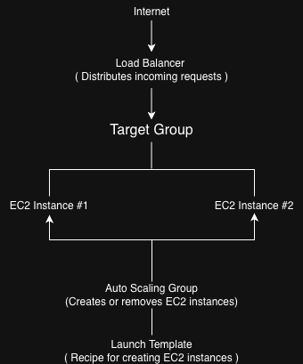

# Week 4 – Task 1: Load Balancing and Auto Scaling

## Objective

Configure an Application Load Balancer (ALB) to distribute incoming traffic across multiple EC2 instances and implement an Auto Scaling Group (ASG) that automatically adjusts the number of instances based on demand.

## Learning Goals

- Understand the purpose of Launch Templates.
- Learn how Application Load Balancers distribute traffic.
- Understand Target Groups and Health Checks.
- Configure Auto Scaling Groups.
- Implement CPU-based scaling policies.

---

## Repository Structure

```
task1/
├── diagrams/
├── launch-template/
│   └── userdata.sh
├── screenshots/
├── notes.md
└── README.md
```

---

## Key AWS Services Used

- Amazon VPC
- Public Subnets
- Internet Gateway
- Route Table
- Security Group
- Launch Template
- EC2
- Application Load Balancer
- Target Group
- Auto Scaling Group

---

## Architecture



```text
                Internet
                    │
                    ▼
      Application Load Balancer
                    │
                    ▼
             Target Group
                    │
                    ▼
        Auto Scaling Group (1–2 EC2)
                    │
                    ▼
             Launch Template
                    │
                    ▼
          Apache Web Server (EC2)
```

---

## Progress

- [x] Planned architecture
- [x] Created project structure
- [x] Created Week 4 VPC
- [x] Created public subnets
- [x] Configured Internet Gateway
- [x] Configured Route Table
- [x] Created Security Group
- [x] Created Launch Template
- [x] Created Target Group
- [x] Created Application Load Balancer
- [x] Created Auto Scaling Group
- [x] Configured CPU Target Tracking Policy
- [x] Tested infrastructure deployment
- [ ] Cleanup

### Live Endpoint:
http://week4-alb-1211713672.ap-south-1.elb.amazonaws.com

---

## Skills Demonstrated

- VPC Networking
- Route Tables
- Internet Gateway
- Security Groups
- Launch Templates
- EC2
- Apache
- Application Load Balancer
- Target Groups
- Health Checks
- Auto Scaling Groups
- Cloud-init
- Linux User Data
- Infrastructure Troubleshooting

---

## Challenge 
Auto Scaling instances launched successfully but repeatedly failed their health checks because Apache was never installed during instance boot.

### Investigation Verified security groups, subnet associations, Internet 
Gateway attachment, launch template versions, auto-assigned public IPs, and user 
data. Eventually traced the issue to an incorrectly configured public route 
table that lacked a valid default route despite appearing associated with the public subnets.

### Resolution
Recreated the public route table with the correct 0.0.0.0/0 → Internet Gateway route, associated it with both public subnets, and confirmed that newly launched Auto Scaling instances could access the internet and complete user-data provisioning.

---

## Key Takeaways

- An Auto Scaling Group creates EC2 instances but does not receive traffic directly.
- A Target Group connects EC2 instances to the Load Balancer.
- Health checks determine whether traffic should be routed to an instance.
- Launch Templates act as immutable blueprints and support versioning.
- Correct subnet routing is essential for successful instance bootstrapping.

---

## Reflection

This task demonstrated how AWS services work together to build a highly available web application. Instead of relying on a single EC2 instance, the infrastructure can now automatically distribute traffic using an Application Load Balancer and adjust the number of running instances using Auto Scaling based on CPU utilization. I also gained a much deeper understanding of Launch Templates, Target Groups, Health Checks, and how these services interact to improve availability and fault tolerance.

---
