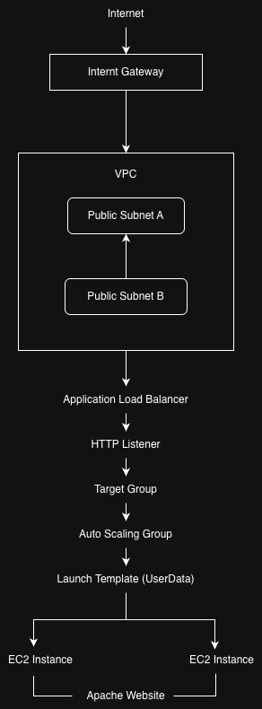

# Week 4 - Task 3: Infrastructure as Code with AWS CloudFormation

## Objective

Automate the deployment of a highly available web application using AWS CloudFormation.

---

## Architecture




```
     Internet
	│
Internet Gateway
	│
       VPC
	│
  Public Subnets
	│
Application Load Balancer
	│
    HTTP Listener
	│
  Target Group
	│
Auto Scaling Group
	│
  Launch Template
	│
EC2 Instances (Apache)
```

---

## Deployment Workflow

```text
CloudFormation Template
        │
        ▼
Validate Template
        │
        ▼
Create Stack
        │
        ▼
Provision Infrastructure
        │
        ▼
Execute UserData
        │
        ▼
Deploy Apache Website
```
---

## Repository Structure

```text
templates/
    full-stack.yaml

screenshots/

diagrams/

notes.md
```
---

## Skills Demonstrated

- AWS CloudFormation
- Infrastructure as Code (IaC)
- Amazon VPC
- EC2 Launch Templates
- Auto Scaling Groups
- Application Load Balancer
- Target Groups
- YAML Template Validation
- CloudFormation Stack Deployment
- Infrastructure Debugging

---

## Why a Single Template?

Although CloudFormation templates can be split into multiple files using nested stacks, this project uses a single template because:

- The infrastructure is relatively small.
- It keeps deployment simple.
- All related resources can be understood in one place.

For larger production environments, separating networking, compute, security, and monitoring into individual templates improves maintainability and team collaboration.

---

## Screenshots

| Screenshot | Description |
|------------|-------------|
|01|CloudFormation create-stack command|
|02|Stack Events|
|03|CREATE_COMPLETE|
|04|Outputs|
|05|Website Verification|

---
