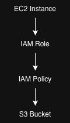

# Week 4 - Task 4
> **Summary**
>
> This project demonstrates secure access to Amazon S3 from an EC2 instance using IAM Roles and a custom least-privilege policy. Temporary credentials provided by AWS STS eliminate the need to store long-term access keys on the instance.

## Objective
The objective of this task was to securely grant an Amazon EC2 instance access to an Amazon S3 bucket without embedding long-term AWS credentials on the instance.

To achieve this, an IAM Role with a custom least-privilege policy was created and attached to the EC2 instance. The role grants permission to list objects and read files only from a designated S3 bucket.

The setup was verified by assuming the IAM role from the EC2 instance and successfully accessing the target bucket using the AWS CLI.

---

## Architecture



```
  EC2
   │
   ▼
IAM Role
   │
IAM Policy
   │
   ▼
S3 Bucket
```

---

## Resources Created

| Resource | Name |
|----------|------|
| S3 Bucket | week4-iam-demo-bucket |
| IAM Policy | Week4EC2S3ReadPolicy |
| IAM Role | Week4EC2S3Role |
| Instance Profile | Week4EC2S3Role |
| EC2 Instance | week4-task4-standalone |

---

## Policy Permissions

The custom IAM policy grants only the permissions required for the task.

### Allowed
- s3:ListBucket
- s3:GetObject

### Resources
- arn:aws:s3:::week4-iam-demo-bucket
- arn:aws:s3:::week4-iam-demo-bucket/*

### Explicitly Not Allowed
- Listing all S3 buckets
- Uploading objects
- Deleting objects
- Modifying bucket configuration
- Accessing any other S3 bucket

---

## Verification

The configuration was verified using the AWS CLI from inside the EC2 instance.

### Verify assumed IAM role

```bash
aws sts get-caller-identity
```

Confirmed that the EC2 instance successfully assumed the IAM role.

### Test denied permission

```bash
aws s3 ls
```

Result:	AccessDenied

This confirms the policy does not grant permission to list all buckets.

### Test allowed permission

```bash
aws s3 ls s3://week4-iam-demo-bucket
```

Successfully listed:
```
hello.txt
```

Verification was performed entirely using the AWS CLI from within the EC2 instance, demonstrating that permissions were granted through the attached IAM Role rather than static credentials.
This confirms the least-privilege policy functions as intended.

---

## Repository Structure

```text
week4/
└── task4/
    ├── diagrams/
    ├── policies/
    ├── screenshots/
    ├── debugging-notes.md
    ├── hello.txt
    └── README.md
```

---

## Principle of Least Privilege

The policy intentionally grants access only to:

- List the target S3 bucket
- Read objects inside the target bucket

The policy does NOT allow:

- Listing all S3 buckets
- Writing objects
- Deleting objects
- Accessing other buckets

This follows AWS security best practices by granting only the minimum permissions required.

---

## Challenges Encountered

While attaching the IAM role, SSH connectivity to the standalone EC2 instance failed despite:

- Correct Security Group rules
- Public subnet with Internet Gateway
- Public IPv4 assigned
- Network ACL allowing all traffic
- Route table verified
- IAM role successfully attached

Troubleshooting performed:

- Verified current public IP using `curl ifconfig.me`
- Tested SSH with verbose logging (`ssh -vvv`)
- Tested TCP connectivity using `nc`
- Verified route tables, subnet configuration and NACL
- Verified Security Group inbound and outbound rules
- Verified instance networking configuration

Although the exact cause could not be conclusively reproduced, recreating the instance resolved the issue. This reinforced the importance of isolating variables and validating infrastructure systematically during troubleshooting.
The instance was recreated to ensure a clean deployment.

---

## Security Principle

Instead of storing AWS credentials on an EC2 instance,
the instance assumes an IAM Role which temporarily receives
credentials from AWS STS.

This follows AWS security best practices by eliminating
long-term access keys.

---

## References

- https://docs.aws.amazon.com/IAM/

- https://docs.aws.amazon.com/AWSEC2/latest/UserGuide/

- https://docs.aws.amazon.com/AmazonS3/latest/userguide/

- https://docs.aws.amazon.com/STS/

---

## Task Completion

- [x] Created S3 bucket
- [x] Uploaded sample object
- [x] Created custom IAM policy
- [x] Created IAM Role
- [x] Attached role to EC2
- [x] Verified role assumption using AWS STS
- [x] Verified least-privilege permissions
- [x] Documented implementation

---

## Outcome

Successfully implemented a least-privilege IAM Role for an EC2 instance and verified secure access to a specific Amazon S3 bucket using temporary AWS STS credentials without storing any access keys on the instance.

---
